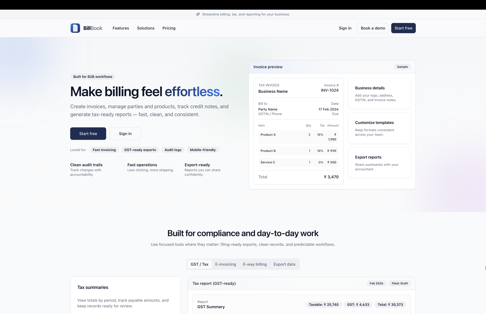
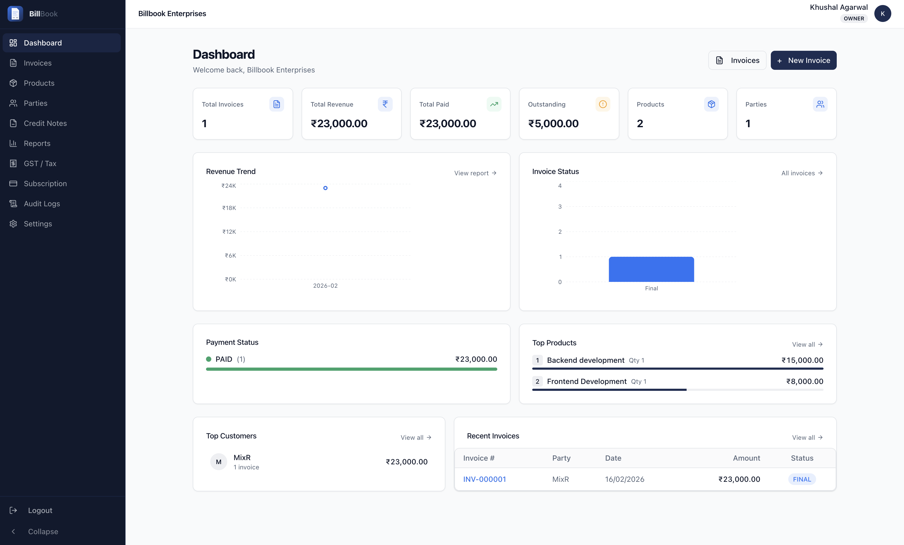

# BillBook Frontend — Billing, Invoicing & GST Reports (React + TypeScript)

BillBook is a modern, responsive **billing & invoicing web app frontend** built for day-to-day B2B operations.
It helps teams manage **invoices**, **credit notes**, **parties (customers/vendors)**, **products**, and **GST / tax-ready reports** with clean workflows.

Keywords: billing software UI, invoicing app, GST reports, credit notes, parties & products management, audit logs, React TypeScript dashboard.

## Table of Contents

- [BillBook Frontend — Billing, Invoicing \& GST Reports (React + TypeScript)](#billbook-frontend--billing-invoicing--gst-reports-react--typescript)
  - [Table of Contents](#table-of-contents)
  - [Features](#features)
  - [Screenshots](#screenshots)
  - [Tech Stack](#tech-stack)
  - [Getting Started](#getting-started)
    - [Prerequisites](#prerequisites)
    - [Environment variables](#environment-variables)
  - [Notes](#notes)
  - [Scripts](#scripts)
  - [Project Structure](#project-structure)

## Features

- **Invoices**: create, view, and manage invoices with line items and totals
- **Credit notes**: track adjustments and corrections
- **Parties**: manage customer/vendor details in one place
- **Products**: manage catalog, pricing, and tax slabs
- **Reports**: view business summaries and export-friendly data
- **GST / Tax summaries**: period totals designed for reconciliation workflows
- **Audit logs**: track key activity for accountability
- **Responsive UI**: mobile-friendly pages and layouts

## Screenshots

Screenshots from the current UI (stored in `docs/screenshots/`):

<table>
  <tr>
    <td width="50%">
      
    </td>
    <td width="50%">
      
    </td>
  </tr>
  <tr>
    <td width="50%">
      
    </td>
    <td width="50%">
      
    </td>
  </tr>
</table>

## Tech Stack

- **React 18** + **TypeScript** — UI framework
- **Vite** — build tool & dev server
- **Tailwind CSS** + **shadcn/ui** — styling & component library
- **Axios** — HTTP client with interceptors
- **TanStack React Query** — server state management
- **React Router v6** — client-side routing
- **React Hook Form** + **Zod** — form handling & validation
- **Recharts** — dashboard charts

## Getting Started

### Prerequisites

- **Node.js** (LTS recommended)
- **Bun** (this repo uses `bun` commands)

```sh
# Install dependencies
bun install

# Copy env file and configure
cp .env.example .env

# Start dev server (http://localhost:5173)
bun dev
```

### Environment variables

This app expects API/auth configuration via `.env`. Start from `.env.example` and update values as needed.

## Notes

- The public landing page lives at `/`.
- Authentication UI is modal-based and opened via query params like `/?auth=login`.

## Scripts

| Script          | Description                      |
| --------------- | -------------------------------- |
| `bun dev`       | Start development server         |
| `bun run build` | Type-check & production build    |
| `bun lint`      | ESLint + TypeScript type-check   |
| `bun lint:fix`  | Auto-fix ESLint issues           |
| `bun fmt`       | Format all files with Prettier   |
| `bun fmt:check` | Check formatting without writing |
| `bun typecheck` | TypeScript type-check only       |

## Project Structure

```
src/
├── api/            # Axios client, interceptors, token management
├── components/     # Shared & layout components
│   ├── ui/         # shadcn/ui primitives
│   └── layout/     # AppLayout, Sidebar, TopBar
├── contexts/       # React context providers (Auth)
├── hooks/          # Custom hooks (data fetching, business logic)
├── lib/            # Env validation, utilities
├── pages/          # Route-level page components
└── types/          # Domain-specific TypeScript types
```
